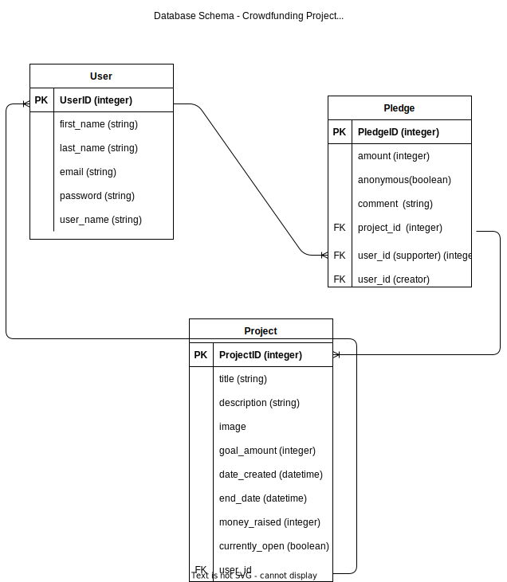

# crowdfunding_back_end

- [x] A link to the deployed project. - https://crowdfunding-back-end-ie.fly.dev

- [X] A screenshot of Insomnia, demonstrating a successful GET method for any
endpoint.

- [X] A screenshot of Insomnia, demonstrating a successful POST method for any
endpoint. 

- [X] A screenshot of Insomnia, demonstrating a token being returned.

- [x] Step by step instructions for how to register a new user and create a new
project (i.e. endpoints and body data).

**New User** 
1. Create a user through https://crowdfunding-back-end-ie.fly.dev/users. In a POST request enter {
	"username": "testusername",
	"password": "testpassword"
}

**Create a new Project**
1. log in with your user details created above at https://crowdfunding-back-end-ie.fly.dev/users
2. Once logged in you will need to send a POST request will the following info 	
   {
    "title": "Project 10.",
    "description": "Show some love for the Swamphens!",
	"goal": "2000",
	"image": "https://images.unsplash.com/,
	"is_open": "true",
	"date_created": "" 
   }
3. POST the details and tada, a new project will be created and active. 

- [x] Your refined API specification and Database Schema. 

# Crowdfunding Back End
Ida Eriksson

## Planning:

### Concept/Name

Clicks for chicks - this is a crowd funding page about birds and atm only birds in Western Australia. It's made as a celebration of what Western Australia Seabird Rescue does, especially after they came and rescued a baby Darter when I called them. 

### Intended Audience/User Stories
The target audience are bird nerds like myself. They are direct descendents from the dinosaurs after all (the birds, not the audience).

<!-- ### Front End Pages/Functionality
- {{ A page on the front end }}
- {{ A list of dot-points showing functionality is available on this page }}
- {{ etc }}
- {{ etc }}
- {{ A second page available on the front end }}
- {{ Another list of dot-points showing functionality }}
- {{ etc }}
-  -->
### API Spec

### DB Schema
