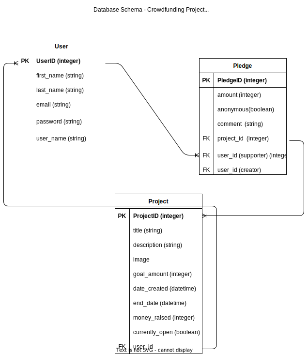

# crowdfunding_back_end

[x] A link to the deployed project. - https://crowdfunding-back-end-ie.fly.dev
[X] A screenshot of Insomnia, demonstrating a successful GET method for any
endpoint.
[X] A screenshot of Insomnia, demonstrating a successful POST method for any
endpoint.
[X] A screenshot of Insomnia, demonstrating a token being returned.
[ ] Step by step instructions for how to register a new user and create a new
project (i.e. endpoints and body data).
[ ] Your refined API specification and Database Schema. 

# Crowdfunding Back End
Ida Eriksson
## Planning:
### Concept/Name
Clicks for chicks - this is a crowd funding page about birds and atm only birds in Western Australia. It's made as a celebration of what Western Australia Seabird Rescue does, especially after they came and rescued a baby Darter when I called them. 

### Intended Audience/User Stories
The target audience are bird nerds like myself. They are direct descendents from the dinosaurs after all (the birds, not the audience).

### Front End Pages/Functionality
- {{ A page on the front end }}
- {{ A list of dot-points showing functionality is available on this page }}
- {{ etc }}
- {{ etc }}
- {{ A second page available on the front end }}
- {{ Another list of dot-points showing functionality }}
- {{ etc }}
### API Spec
{{ Fill out the table below to define your endpoints. An example of what this
might look like is shown at the bottom of the page.
It might look messy here in the PDF, but once it's rendered it looks very neat!
It can be helpful to keep the markdown preview open in VS Code so that you can
see what you're typing more easily. }}
| URL | HTTP Method | Purpose | Purpose | Request Body | Success Response Code |
Authentication/Authorisation |
| --- | ----------- | ------- | ------- | ------------ | --------------------- |
---------------------------- |
| | | | | | |
|

### DB Schema
